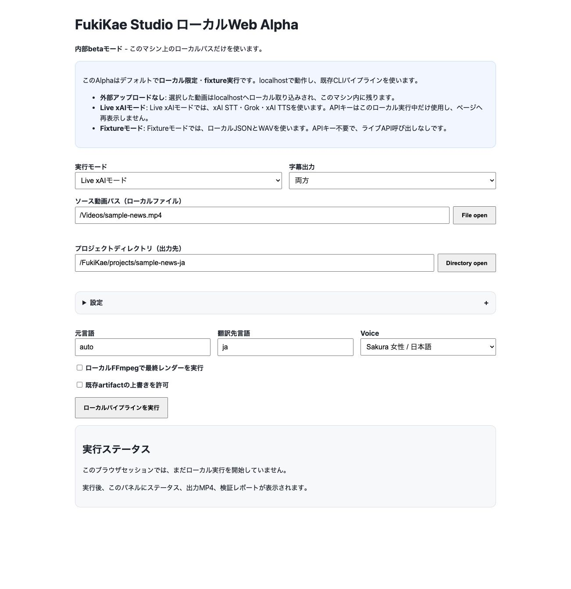
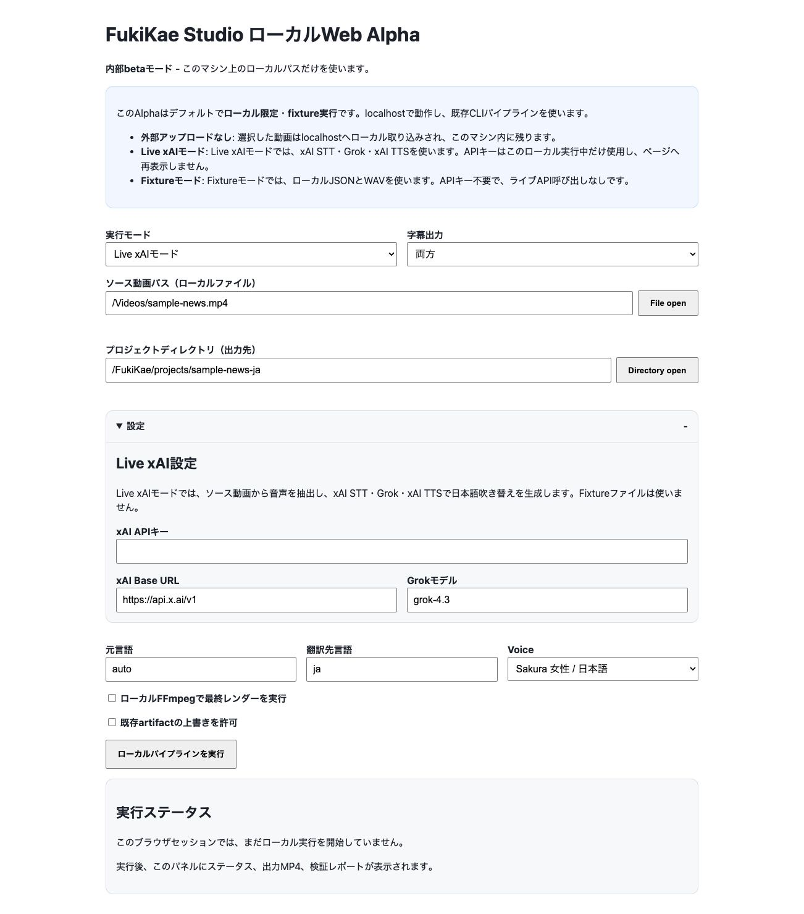

# FukiKae Studio

FukiKae Studioは、ローカル動画を日本語吹き替えMP4に変換する、ローカルファーストのオープン開発ツールです。動画ファイルを外部SaaSへ預けず、自分のPC上で音声抽出、STT、翻訳・吹き替え台本生成、TTS、字幕生成、MP4レンダーを実行します。

このリポジトリの配布版は、まず内部beta・個人検証向けです。商用SaaSではなく、アプリ自体は無料です。Live xAIモードを使う場合は、ユーザー自身のxAI API Keyが必要で、発生する費用はxAI APIの従量課金です。

## なぜ作ったのか

動画の吹き替えは、AI SaaSにアップロードすれば簡単に試せます。一方で、ニュース素材、顧客素材、未公開動画、制作途中の素材では、アップロード先、保存期間、再利用、チーム権限、月額費用が気になります。

FukiKae Studioは次の目的で作っています。

- ローカル動画をできるだけ外に出さずに日本語吹き替えを作る。
- AI SaaSの月額・クレジット制ではなく、ユーザー自身のxAI API使用量だけで検証できるようにする。
- STT、翻訳、TTS、字幕、最終muxを分解し、どこで失敗したか見えるようにする。
- Grokで翻訳文の長さを調整し、元動画の発話タイミングに近い日本語吹き替えを作る。
- 焼き込み字幕とソフト字幕の両方を比較できるようにする。

## できること

- ローカルWeb UI alphaを起動して、ブラウザから動画を選択できます。
- Live xAIモードで、xAI STT、Grok 4.3、xAI TTSを使った日本語吹き替えを生成できます。
- Fixture betaモードで、APIなしのローカルテストを実行できます。
- Sakura female / Japanese、Ren male / JapaneseなどのxAI Voiceを選択できます。
- 焼き込み字幕、ソフト字幕、両方の出力を選べます。
- 最終出力、検証レポート、中間artifactをローカルプロジェクトディレクトリに残します。

## 画面イメージ

メイン画面では、動画ファイル、出力先、Voice、字幕出力を選びます。API Key欄は初期表示では閉じています。



`設定`を開くと、Live xAI用のAPI Keyとモデル設定を入力できます。API Keyは実行中だけ使い、画面へ再表示しません。



## 料金の考え方

FukiKae Studio自体は無料です。サーバー利用料、月額利用料、FukiKae側の手数料はありません。

Live xAIモードで必要なのは、ユーザー自身のxAI API Keyです。API費用はxAIから直接請求されます。xAI公式Pricingでは、2026-05-28時点で次の価格が公開されています。

| 項目 | 価格 |
| --- | ---: |
| Grok 4.3 input | $1.25 / 1M tokens |
| Grok 4.3 output | $2.50 / 1M tokens |
| xAI Speech to Text REST | $0.10 / hour |
| xAI Text to Speech | $15.00 / 1M characters |

出典: [xAI Pricing](https://docs.x.ai/developers/pricing)、[xAI Models](https://docs.x.ai/developers/models)

### 目安

10分の一般的なナレーション動画を例にすると、概算は次のようになります。

| 処理 | 仮定 | 概算 |
| --- | --- | ---: |
| STT | 10分 = 0.166時間 | 約$0.017 |
| Grok 4.3 | input 8k tokens / output 6k tokens | 約$0.025 |
| TTS | 日本語3,000から6,000文字 | 約$0.045から$0.090 |
| 合計 | 1回生成、リトライなし | 約$0.09から$0.13 |

60分動画なら、内容量が同程度に比例すると仮定して約$0.54から$0.78程度が一つの目安です。実際の費用は、発話量、翻訳の長さ、リトライ回数、モデル設定、xAI側の最新価格で変わります。

## 必要なもの

- macOSまたはLinux
- Python 3.9以上
- FFmpeg / ffprobe
- xAI API Key（Live xAIモードのみ）

macOSでFFmpegがない場合:

```bash
brew install ffmpeg
```

## インストール

GitHubからcloneします。

```bash
gh repo clone Oranquelui/Fukikae_Studio
cd Fukikae_Studio
```

GitHub CLIを使わない場合:

```bash
git clone https://github.com/Oranquelui/Fukikae_Studio.git
cd Fukikae_Studio
```

Python仮想環境を作ります。

```bash
python3 -m venv .venv
.venv/bin/python -m pip install --upgrade pip
.venv/bin/python -m pip install -e . pytest
```

動作確認:

```bash
PYTHONPATH=src .venv/bin/python -m pytest
```

## 起動

ローカルWeb UIを起動します。

```bash
PYTHONPATH=src .venv/bin/python -m fukikae_studio studio
```

ターミナルに表示されたURLを開きます。

```text
http://127.0.0.1:8765/?key=...
```

## 使い方

画面で行うこと:

1. 実行モードで`Live xAIモード`を選ぶ。
2. `File open`でソース動画を選ぶ。
3. `Directory open`でプロジェクトディレクトリ（出力先）を選ぶ。
4. `設定`を開いてxAI API Keyを入力する。このKeyは実行中だけ使い、画面へ再表示しません。
5. Voiceを選ぶ。
6. 字幕出力を選ぶ。
7. `ローカルFFmpegで最終レンダーを実行`をONにする。
8. `ローカルパイプラインを実行`を押す。

`File open`で選んだ動画は外部にアップロードされません。localhostの`work/studio-uploads/`へローカルコピーされ、そのコピー先パスがフォームへ入ります。
`Directory open`はmacOSのフォルダ選択ダイアログを使い、選んだ出力先パスだけをローカルフォームへ入れます。

## 出力ファイル

プロジェクトディレクトリ内に主なartifactが生成されます。

| パス | 内容 |
| --- | --- |
| `input/source.mp4` | 入力動画コピー |
| `audio/stt_input.wav` | STT用音声 |
| `stt/normalized_segments.json` | 正規化された文字起こしセグメント |
| `script/dubbing_segments.json` | Grokが生成した日本語吹き替えセグメント |
| `tts/` | TTS音声とmanifest |
| `assembly/japanese_subtitles.srt` | 日本語SRT字幕 |
| `assembly/japanese_subtitles.ass` | 焼き込み用ASS字幕 |
| `output/dubbed.ja.burned.mp4` | 焼き込み字幕つきMP4 |
| `output/dubbed.ja.mp4` | ソフト字幕つきMP4 |
| `validation/local_test_report.json` | 検証レポート |

## Voice

現在のUIでは次を選べます。

| 表示 | voice_id | language |
| --- | --- | --- |
| Sakura 女性 / 日本語 | `d0cb9ff07d95` | `ja` |
| Ren 男性 / 日本語 | `b1a7441b97a1` | `ja` |
| Eve 女性 / 多言語 | `eve` | `multilingual` |

## 注意

- このalphaはローカル実行前提です。
- localhost以外へのbindは拒否します。
- API Keyは画面へ再表示しません。
- API Keyを含むファイル、`work/`、`test_temp/`、`.venv/`は配布対象外です。
- 生成結果の品質は、入力音声、STT品質、翻訳長、TTS voice、FFmpeg環境に左右されます。
- xAIの料金とモデル提供状況は変わる可能性があります。最新情報は[xAI Pricing](https://docs.x.ai/developers/pricing)を確認してください。

## 開発者向けドキュメント

- [Solo Local Beta Test](docs/SOLO_BETA_TEST.md)
- [App Shape Research](docs/APP_SHAPE_RESEARCH.md)
- [Provider Policy](docs/PROVIDER_POLICY.md)
- [xAI Endpoint Notes](docs/XAI_ENDPOINT_NOTES.md)
- [Public Sample Runbook](docs/PUBLIC_SAMPLE_RUNBOOK.md)
